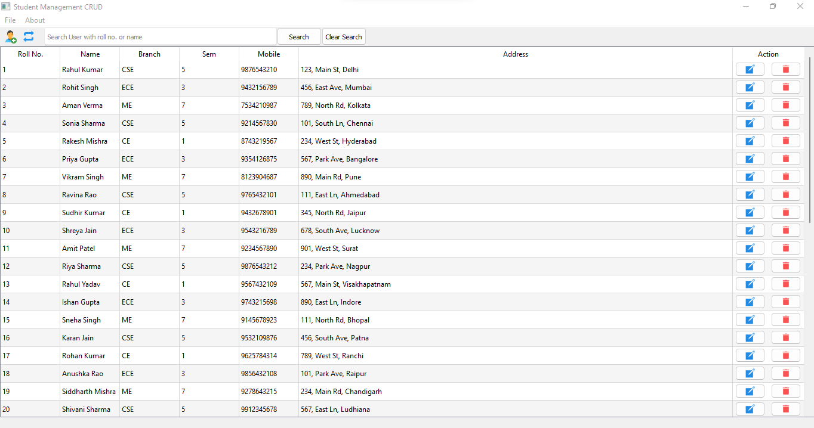

# PyQt-Sqlite-Project-CURD  
Pyqt SQLite Project Have Features like login, Add, Delete, Search, Update, Show the Students. In this, I show all the CURD operations of the Program. All Project is well represented and with interactive Toolbar &amp; Menu bar. The database is included in the repository.

# Features

* Dashboard
* Login
* User list
* Add User
* Search User
* Modify User
* Delete User

## Screenshot

### Database Files are included in Project. (database.sql)

### Author

Ajay Randhawa

## Donate
If you appreciate that, please consider donating to the Developer.

 

### Happy Open Source..
  
